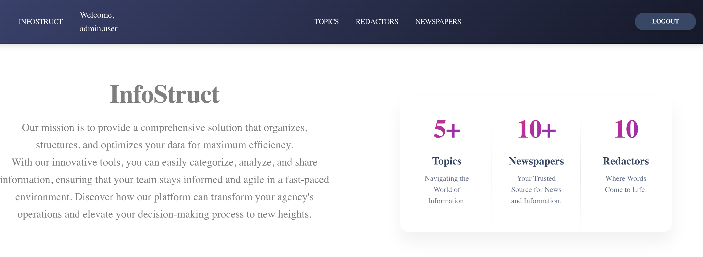
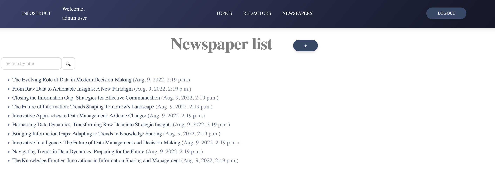
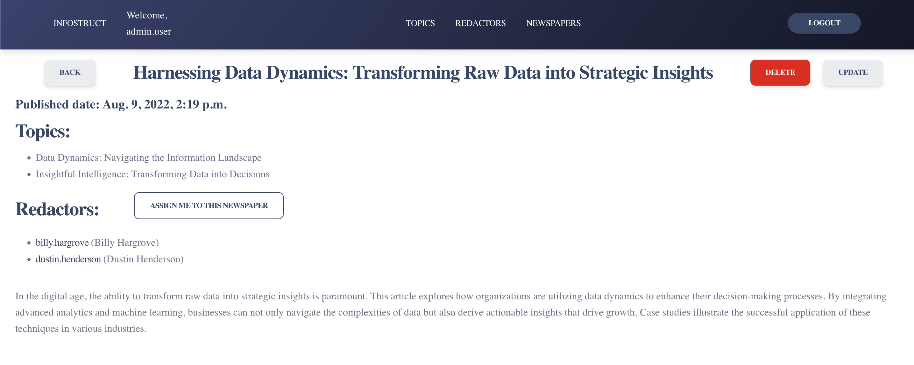

## Inform agency "InfoStruct"

### Here is implementation of inform agency, where you can store info about redactors and their newspapers. Also implemented ability to get detailed data and update it if needed.

- If you want to use test data run 

`python manage.py loaddata inform_agency_db_data.json`

- After loading data from fixture you can use following superuser (or create another one by yourself):
    - Login: `admin.user`
    - Password: `1qazcde3`

Feel free to add more data using admin panel, if needed.

#### main page view:

### data example:

### detailed page:

### login form:

